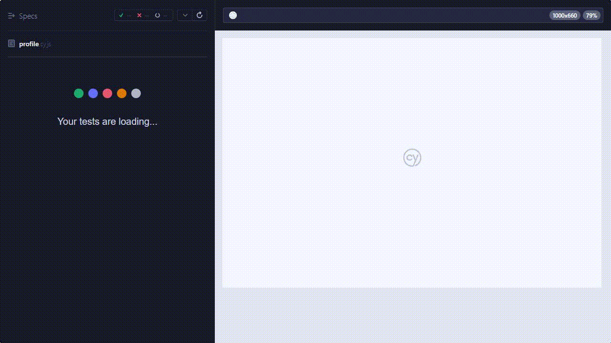

 
  
# 🛠 Kahina Saidi – QA Tester | Manual & Automation Testing

👋 Bonjour ! Je suis Kahina, passionnée par la qualité logicielle et la fiabilité des applications.  
Mon objectif : **détecter, documenter et résoudre les bugs avant qu’ils n’atteignent les utilisateurs**

---

## 🔧 Outils & Technologies QA

---

## 🚀 À propos de moi

- 🧪 Tests manuels & automatisés (Cypress, Selenium)
- 🐞 Détection et suivi de bugs avec Jira
- 🔍 Rédaction de cas de test et plans de test
- ⚙️ Automatisation E2E et tests API
- 🌐 Tests multi-navigateurs & responsive
- 📊 Méthodologie Agile / Scrum
- 📄 Reporting QA clair et structuré

---

## 🚀 Projets QA

---

### 🧪 1️⃣ Mission Freelance – QA Testing Banking Application (Argent Bank)

🔧 **Outils utilisés :** Cypress | Jira | Postman  

---

### 🔐 Test de connexion

---

### 🧑‍💻 Accès au Dashboard (après connexion)

### 🐞 Bug Report 

### 🐞 Bug Report – Profile Data Not Displayed

- **Bug :** Le nom utilisateur ne s’affiche pas après connexion  
- **Sévérité :** Moyenne  

- **Étapes :**
  1. Aller sur la page login  
  2. Saisir les identifiants  
  3. Cliquer sur "Sign In"  

- **Résultat attendu :** le nom utilisateur (ex: "Steve") s’affiche sur le dashboard  
- **Résultat réel :** le nom n’apparaît pas  

- **Détails techniques :**
  - Erreur API : `POST /user/profile → 404`
  - Échec du test Cypress : `expected undefined to exist`

### ✅ Scénarios testés

- Connexion utilisateur (valide / invalide)
- Déconnexion
- Accès sécurisé au dashboard
- Modification du profil

### 📊 Résultats

- ✔ 10 tests exécutés  
- ✔ 1 bugs détectés  

## 🧪 2️⃣🧪 Mission QA – Application Web React (NeoQualis)
📍 France
📅 Contrat : CDD – Projet QA Web Application

🎯 Contexte

Dans le cadre d’une mission QA chez Neoqualis, j’ai participé à la validation d’une application web développée avec React et React Router, visant à offrir une expérience utilisateur moderne et fluide.

🧪 Objectif de la mission

Assurer la qualité fonctionnelle et visuelle d’une application front-end en :

Vérifiant le bon affichage des composants React
Validant la navigation entre les pages (React Router)
Testant l’intégration des données simulées (JSON)
Garantissant une expérience utilisateur cohérente

🔍 Activités réalisées
🧪 Tests manuels des composants React
🔗 Validation du routing (navigation entre pages)
📱 Tests responsive (mobile, tablette, desktop)
🐞 Détection et documentation des anomalies
📋 Rédaction de cas de test
🔄 Tests de non-régression

🛠 Environnement technique

React
React Router
Vite
Node.js
JSON (mock data)

🐞 Exemple de bug détecté
Bug : Navigation incorrecte entre pages
Description : La route ne charge pas le bon composant
Impact : Expérience utilisateur dégradée
Correction : Vérification du routing React Router

🚀 Résultats
✔ Amélioration de la navigation utilisateur
✔ Correction de bugs UI et routing
✔ Validation complète du front-end

## 🧪 3️⃣ QA Testing – Projets OpenClassrooms

- Tests sur applications React & Node.js
- Détection de bugs et validation
- Rédaction de rapports QA
- Collaboration avec développeurs

---

## 💻 Compétences

### 🧪 Testing
- Tests manuels
- Tests E2E (Cypress, Selenium)
- Tests API REST (Postman)
- Tests de non-régression
- Tests UX / Accessibilité

### 🛠 Outils QA
- Jira
- Squash TM
- Cypress
- Selenium
- Postman

### 📊 Méthodologies
- Agile / Scrum
- STLC (Software Testing Life Cycle)
- Test cases & test plans
- Bug reporting

---

## 📄 CV

📄 [Télécharger mon CV](./docs/CV_Kahina_Saidi.pdf)

---

## 🌐 Contact

- ✉️ kahinas24@example.com  
- 🔗 https://www.linkedin.com/in/Kahina-saidi-Qa  
- 💻 https://github.com/kahinas24🔗 LinkedIn : https://www.linkedin.com/in/Kahina-saidi-Qa  
- 💻 GitHub : https://github.com/kahinas24
